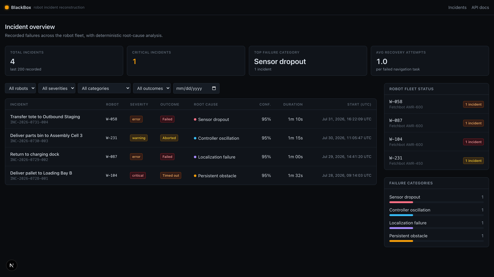
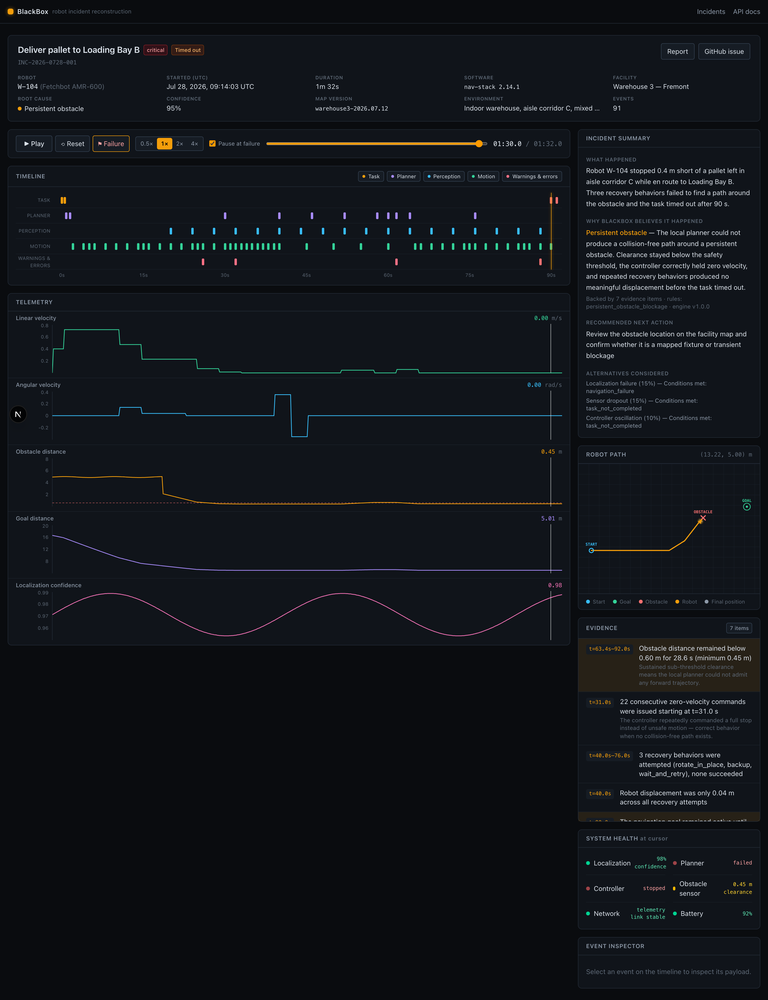
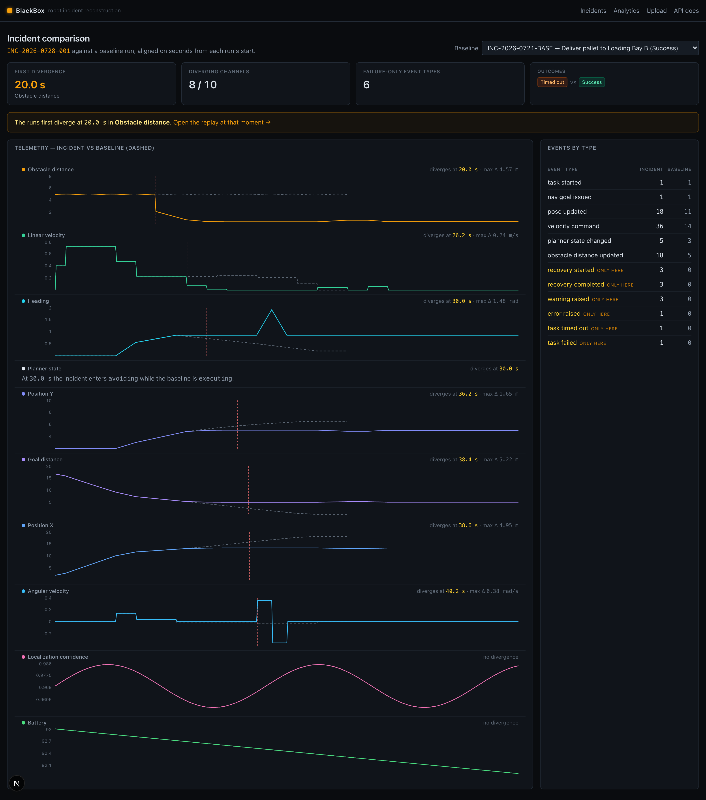
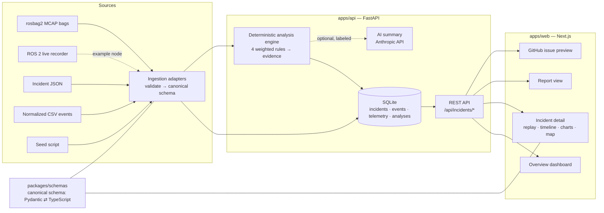

# BlackBox

[](https://github.com/arnavsharmaa/blackbox/actions/workflows/ci.yml)
[](LICENSE)
[](apps/api/pyproject.toml)
[](package.json)

**BlackBox reconstructs robot failures from telemetry, planner decisions, sensor streams, and controller actions—then produces a replayable, evidence-backed incident report.**

BlackBox is a flight recorder and incident-reconstruction platform for
autonomous robots. When a navigation task fails, it answers the questions an
engineer actually asks:

- What was the robot trying to do?
- What happened immediately before the failure?
- Which subsystem likely caused it — and what evidence supports that?
- What should be investigated next?
- Can the incident be replayed deterministically?

Root-cause detection is **deterministic and rules-based**: every diagnosis is
backed by timestamped evidence you can click to jump the replay to. An
optional LLM layer can summarize the analysis, but it never determines the
root cause and the product is fully useful without any API key.

> **Status:** working end-to-end — ingestion (JSON/CSV/ROS 2 MCAP), analysis,
> replay, baseline diffing, reports, analytics, all CI-tested. The current
> focus is validating
> the pipeline against **bags recorded from real robots**; if you run Nav2
> and have a failure bag to share, see the [roadmap](#roadmap).

**Incident overview** — fleet stats, filters, deterministic diagnoses:



**Incident replay** (paused at the failure moment) — synchronized timeline,
telemetry cursors, 2D path map, evidence panel, per-subsystem health:



**Incident comparison** — the failure diffed against a known-good baseline
run, with the first sustained divergence pinned per channel:



> Reproduce locally: `make demo`, open http://localhost:3000, and open the
> primary incident (`INC-2026-0728-001`) — the demo scenario below.

## Architecture



**Boundaries:** ingestion (adapters) → analysis (pure rules over derived
features) → storage (SQLAlchemy repository) → API (FastAPI routers). The
frontend consumes the API only. One canonical incident schema is defined in
Pydantic ([apps/api/blackbox_api/schemas/incident.py](apps/api/blackbox_api/schemas/incident.py)),
mirrored in TypeScript ([packages/schemas/src/incident.ts](packages/schemas/src/incident.ts)),
exported as JSON Schema ([packages/schemas/incident.schema.json](packages/schemas/incident.schema.json)),
and guarded against drift by
[a sync test](apps/api/tests/test_schema_sync.py).

## Core features

- **Deterministic root-cause analysis** — four rules (persistent obstacle,
  localization failure, controller oscillation, sensor dropout) score
  weighted conditions over derived features; each diagnosis returns a
  confidence, evidence anchored to timestamps, recommended investigation
  steps, and the alternative causes considered.
- **Deterministic replay** — play/pause, 0.5×–4× speed, scrubbing, jump to
  failure, optional auto-pause at the failure moment. The replay clock drives
  the timeline cursor, five synchronized telemetry charts, the 2D path map,
  the system-health panel, and the event inspector from one store.
- **Evidence you can click** — every evidence item seeks the replay to the
  moment it describes, and any replay moment can be copied as a shareable
  deep link (`/incidents/{id}?t=45`) for tickets and chat.
- **Incident diffing** — compare a failure against a known-good run of the
  same task: telemetry overlaid channel-by-channel, the first sustained
  divergence marked per channel, a headline "the runs first diverge at
  20.0 s in obstacle distance" that deep-links the replay, and an
  event-type comparison that calls out failure-only events.
- **Incident reports** — executive summary, metadata, root cause, evidence,
  key timeline, telemetry extremes, reproduction notes; copy as Markdown,
  download as JSON, print view.
- **GitHub issue generation** — complete issue Markdown (repro steps,
  expected/actual, evidence, investigation list) with copy, download, and a
  prefilled `github.com/.../issues/new` URL. No OAuth needed.
- **Ingestion with useful errors** — JSON, normalized-CSV, and ROS 2 MCAP
  uploads (drag-and-drop on the Upload page, or the API) are validated
  against the canonical schema; malformed input returns field-level errors
  (HTTP 422), never a stack trace.
- **Fleet analytics** — a cross-incident dashboard: failure-category and
  outcome mix, per-robot and per-software-version stats, recurring blockage
  hotspots, and a daily trend.
- **Measured confidence** — engineers confirm or correct each diagnosis in
  one click; analytics reports the resulting precision per category, so
  "95% confidence" is checked against how often humans actually agreed.
- **ROS 2 bag ingestion** — upload a rosbag2 MCAP recording directly
  (`ros2 bag record -s mcap`); decoding is pure Python, so ROS is *not*
  required to run BlackBox. Plus a documented adapter interface, topic
  mapping, and an example live recorder node. `make demo-bag` generates a
  sample bag to try.

## Demo scenario

The primary seeded incident `INC-2026-0728-001` reconstructs warehouse robot
**W-104** failing a delivery to **Loading Bay B**:

1. W-104 receives the navigation goal and drives normally down aisle
   corridor C.
2. A pallet blocks the route; obstacle clearance drops below the 0.60 m
   safety threshold.
3. The local planner can't find a collision-free trajectory; the controller
   holds zero velocity (22 consecutive zero commands).
4. Three recovery behaviors run — rotate_in_place, backup, wait_and_retry —
   and all fail; displacement across them is 0.04 m.
5. A global replan finds no alternate route. Localization stays above 95%
   the whole time.
6. The task times out at t=90 s and fails.

**Deterministic diagnosis:** persistent obstacle blockage (95% confidence,
7 evidence items) — the robot correctly stopped rather than issuing unsafe
motion; localization is explicitly ruled out with exculpatory evidence.

Three more incidents exercise the other rules: a localization-confidence
collapse next to reflective racking (`…-002`), controller oscillation in a
0.78 m doorway (`…-003`), and a 22 s lidar dropout (`…-004`). A fifth
sample (`INC-2026-0721-BASE`) is a *successful* run of the same delivery a
week earlier — the known-good baseline the comparison view diffs against,
which pins the first divergence at t=20 s when the failed run's lidar picks
up the pallet, ten seconds before the robot stops. All sample data is
generated deterministically — fixed timestamps, no randomness — by
[packages/sample-data/generate.py](packages/sample-data/generate.py).

## Quick start

Prerequisites: Python ≥ 3.11, Node ≥ 20, `make`. (Or use
[Docker](#docker-setup) instead.)

```bash
make setup   # venv + backend deps + npm install
make demo    # seed the 4 sample incidents, start API (:8000) + web (:3000)
```

Open **http://localhost:3000**, click into
**“Deliver pallet to Loading Bay B”**, and press **Play**.

## Local development

| Command | What it does |
| --- | --- |
| `make setup` | Create `.venv`, install backend (`apps/api[dev]`) and frontend deps |
| `make seed` | Regenerate deterministic sample incidents and load them |
| `make dev` | Run API (uvicorn, port 8000) and web (Next.js, port 3000) together |
| `make api` / `make web` | Run one side with reload |
| `make test` | Backend pytest + frontend vitest |
| `make lint` | ruff + mypy (strict) + eslint + `tsc --noEmit` |
| `make build` | Production build of the frontend |
| `make smoke` | End-to-end smoke test against a running stack |
| `make e2e` | Playwright browser tests against a running stack |
| `make schema` | Re-export the JSON Schema from the Pydantic models |
| `make openapi` | Re-export `docs/openapi.json` from the FastAPI app |

Copy `.env.example` to `.env` to override defaults (database path, CORS,
API URL, optional AI key). Database initialization is repeatable: tables are
created on startup and `make seed` upserts the sample incidents.

## Docker setup

```bash
docker compose up --build
```

- `api` seeds the database on start, serves on `:8000`, with a `/health`
  healthcheck.
- `web` builds the production bundle and serves on `:3000` once the API is
  healthy.

Data persists in the `blackbox-data` volume. The compose setup is exercised
in CI on every push: the docker job builds both images, boots the stack, and
runs the end-to-end smoke test against it.

## API

Interactive docs at http://localhost:8000/docs. A committed OpenAPI spec
lives at [docs/openapi.json](docs/openapi.json) for client generation and
contract diffing (`make openapi` regenerates it).

| Endpoint | Description |
| --- | --- |
| `GET /health` | Service, schema, and engine status |
| `GET /api/incidents` | Paginated list; filters: `robot_id`, `severity`, `outcome`, `failure_category`, `start_after`, `start_before`, `limit`, `offset` |
| `GET /api/incidents/{id}` | Full incident + stored analysis |
| `GET /api/incidents/{id}/events` | Events; filters: `event_type`, `severity` |
| `GET /api/incidents/{id}/telemetry` | Telemetry series; filter: `channel` |
| `GET /api/incidents/{id}/analysis` | Deterministic analysis (`?ai=true` attaches a labeled AI summary if a key is configured) |
| `POST /api/incidents/{id}/reanalyze` | Re-run the rules engine |
| `POST /api/incidents/{id}/feedback` | Record an engineer's verdict (confirmed / corrected + actual category); feeds calibration |
| `DELETE /api/incidents/{id}` | Remove an incident and its events, telemetry, and analysis |
| `GET /api/incidents/{id}/diff/{baseline_id}` | Compare two runs: per-channel deltas, first sustained divergence, event-type comparison |
| `GET /api/incidents/{id}/report` | Structured report + Markdown |
| `GET /api/incidents/{id}/github-issue` | Issue title/body/labels (`?repo=owner/repo` adds a prefilled URL) |
| `GET /api/analytics` | Fleet analytics: category/outcome mix, per-robot and per-software-version stats, blockage hotspots, daily trend |
| `POST /api/incidents/upload` | Multipart upload of `.json` (full incident), `.csv` (events + `metadata` form field), or `.mcap` (ROS 2 bag + `metadata` with at least `id` and `robot_id`) |

Invalid uploads return `422` with `{"message", "errors": [{field, error, input_preview}]}`.

## Incident schema

An incident is one failed (or notable) task execution:

- **Metadata** — id, robot id/model, facility, task name/goal, start/end
  time, outcome (`success | failed | timed_out | aborted`), severity,
  software & map versions, environment, summary.
- **Events** — timestamped, typed (`task_started`, `nav_goal_issued`,
  `pose_updated`, `velocity_command`, `planner_state_changed`,
  `obstacle_distance_updated`, `recovery_started`, `recovery_completed`,
  `warning_raised`, `error_raised`, `task_timed_out`, `task_failed`) with
  source subsystem, severity, message, structured payload, correlation id,
  and evidence tags.
- **Telemetry** — typed series (`pos_x`, `pos_y`, `heading`,
  `linear_velocity`, `angular_velocity`, `obstacle_distance`,
  `goal_distance`, `localization_confidence`, `planner_state`,
  `recovery_count`, `battery_pct`) sampled as `t` seconds from start.

Validation enforces event ordering within the incident window, per-channel
sample types and ordering, and no duplicate channels. See the
[JSON Schema](packages/schemas/incident.schema.json) for the exact contract.

## Analysis rules

Each rule scores weighted conditions computed from derived features
([features.py](apps/api/blackbox_api/analysis/features.py)); the top rule
above a 0.5 threshold wins, capped at 95% confidence, with the rest reported
as alternatives. No LLM is involved.

| Rule | Key conditions |
| --- | --- |
| `persistent_obstacle_blockage` | clearance < 0.60 m for ≥ 5 s · ≥ 5 consecutive zero-velocity commands · ≥ 2 recovery attempts · displacement < 0.3 m during recoveries · goal still active · timeout. Adds exculpatory evidence when localization stayed ≥ 90%. |
| `localization_failure` | confidence < 0.5 · drop > 0.4 within 5 s · pose jump > 1 m between samples · planner in `waiting_for_localization` · navigation failure |
| `controller_oscillation` | ≥ 8 angular-command sign flips (\|ω\| ≥ 0.3 rad/s) · forward progress < 0.5 m in the window · ≥ 2 replans · mean speed < 0.15 m/s · task not completed |
| `sensor_dropout` | sensor gap > max(5× median interval, 2 s) · stale-timestamp diagnostics · planner degraded after the gap · task not completed |

If nothing clears the threshold the result is `unknown` with manual-review
guidance — the engine does not guess.

Deployments can also add **custom rules without forking**: set
`BLACKBOX_EXTRA_RULES=module:function` (comma-separated) to importable
functions with the built-in rule signature — they compete with the built-in
rules on equal footing (see
[plugins.py](apps/api/blackbox_api/analysis/plugins.py)).

Every numeric threshold in the table above is configurable per deployment
via `BLACKBOX_RULE_*` environment variables (see
[thresholds.py](apps/api/blackbox_api/analysis/thresholds.py) and
`.env.example`), so facilities can tune detection — e.g. a wider clearance
threshold for fast aisles — without forking the rules. Overridden values
flow through to the evidence text and the replay's threshold guides.

### Optional AI explanation

If `ANTHROPIC_API_KEY` or `OPENAI_API_KEY` is set (and
`pip install -e "apps/api[ai]"`), `GET /api/incidents/{id}/analysis?ai=true`
attaches a short AI-generated summary (Anthropic is preferred when both keys
are present; override models with `BLACKBOX_AI_ANTHROPIC_MODEL` /
`BLACKBOX_AI_OPENAI_MODEL`). The prompt contains only the structured analysis and its evidence,
forbids unsupported conclusions, and the response is validated (length,
on-category) before being stored; it is always labeled as AI-generated in the
UI and report, and everything falls back to the deterministic explanation
without a key.

## ROS 2 integration path

ROS 2 is not required to run BlackBox. The full walkthrough — record a
Nav2 failure in Gazebo and run it through the pipeline — is in
[docs/hardware-validation.md](docs/hardware-validation.md). The pieces:

1. **rosbag2 (MCAP) ingestion — implemented.** Upload a `.mcap` bag to
   `POST /api/incidents/upload` with a small metadata JSON (`id`,
   `robot_id`, optional overrides); the adapter decodes `/odom`, `/cmd_vel`,
   `/scan`, `/amcl_pose`, and `/navigate_to_pose/_action/status` with
   pure-Python `mcap-ros2-support`, derives the outcome from the terminal
   goal status, and runs the normal validate→persist→analyze pipeline.
   `make demo-bag` writes a deterministic sample bag and prints the upload
   command.
2. **Adapter interface** — [robotics/adapters/README.md](robotics/adapters/README.md)
   documents `IncidentAdapter`; new formats plug into the same pipeline.
3. **Topic mapping** — pure, ROS-free conversion helpers live in
   [ros2_mapping.py](apps/api/blackbox_api/ros2_mapping.py) (re-exported for
   ROS environments via `robotics/adapters/ros2_topic_mapping.py`).
4. **Live recorder** — [robotics/ros2/blackbox_recorder.py](robotics/ros2/blackbox_recorder.py)
   is an example `rclpy` node that buffers canonical samples and POSTs an
   incident when a Nav2 goal aborts.

## Testing

```bash
make test        # backend (pytest) + frontend (vitest)
make lint        # ruff, mypy --strict, eslint, tsc --noEmit
make build       # next build
make demo        # in one shell…
make smoke       # …then the HTTP smoke test in another
make e2e         # …and/or the Playwright browser suite
```

Backend tests cover schema validation, event ordering, the JSON/CSV/MCAP
ingestion adapters, invalid-upload errors, all four diagnoses (plus
determinism and distinctness), threshold overrides, rule plug-in loading,
fleet analytics aggregation, API response shapes/filters, and
Pydantic⇄TypeScript schema sync. Frontend tests cover the replay store
(tick, pause-at-failure, speed, clamping), overview
rendering/filters/error/empty states, timeline selection and category
filters, evidence timestamp navigation, replay controls, the event
inspector, report rendering, the analytics dashboard, the upload flow
(including 422 field errors), incident deletion, the comparison view, and
replay deep links. The Playwright suite drives the real browser through
the full demo flow — overview, filters, replay to the failure moment,
evidence seeking, timeline inspection, report, the GitHub issue preview,
fleet analytics, the incident diff with its replay deep link, and upload
validation — and runs in CI against the production build.

## Limitations

- SQLite + `create_all` initialization — right for a local MVP; a real
  deployment would want Postgres and migrations (see the roadmap).
- Telemetry is stored row-per-sample; fine at demo scale, but long incidents
  would warrant chunked storage.
- rosbag2 ingestion supports the MCAP storage format and all seven core
  Nav2 topics; the sqlite3 (`.db3`) storage plugin is not handled, and it
  has been validated against synthetic bags, not hardware recordings. The
  live recorder node is an example, untested against real hardware.
- No authentication — BlackBox assumes a trusted network.

## Roadmap

Where BlackBox is heading, in the order the work should land.

### Now — validate against reality

- [ ] **Hardware bag validation** — ingest MCAP bags recorded from real
  Nav2 robots (TurtleBot, or any fleet willing to share failure bags) and
  fix what the synthetic bags didn't predict. *This is the single
  highest-value contribution an outside user can make:* follow the
  [hardware validation guide](docs/hardware-validation.md) (Gazebo works,
  no hardware needed) and
  [open a bag validation report](https://github.com/arnavsharmaa/blackbox/issues/new?template=bag-validation.md)
  with what the diagnosis got right or wrong.
- [ ] **Confidence calibration data** — the machinery shipped (engineer
  verdicts + measured precision per category in analytics); what's needed
  now is volume: reviewed incidents from real deployments.
- [ ] **`.db3` bag support** — the rosbag2 sqlite3 storage plugin, for
  fleets that don't record MCAP. Blocked on message-definition sourcing
  (sqlite3 bags don't embed types the way MCAP does); likely lands as an
  optional ROS-required extra.

### Next — production deployment

- [ ] **Postgres + Alembic migrations** — swap `create_all` for real
  migrations behind the existing repository interface; SQLite stays the
  zero-config default.
- [ ] **Auth & multi-tenancy** — API tokens per fleet, so one BlackBox
  instance can serve multiple facilities without seeing each other's data.
- [ ] **Chunked telemetry storage** — column-oriented blobs per channel
  instead of row-per-sample, for hour-long incidents at full sample rates.
- [ ] **Live streaming ingestion** — a WebSocket endpoint with rolling
  pre-failure ring buffers, so robots stream continuously and BlackBox cuts
  an incident automatically when a task fails (the live recorder node
  becomes a supported client instead of an example).

### Later — deeper analysis

- [ ] **Cross-incident rule mining** — surface recurring patterns the
  per-incident rules can't see (e.g. the same shelf edge degrading
  localization across dozens of near-misses that never became incidents).
- [ ] **Community rule registry** — a home for shared
  [`BLACKBOX_EXTRA_RULES` plug-ins](apps/api/blackbox_api/analysis/plugins.py)
  (battery sag, wheel slip, motor-current anomalies) with fixture incidents
  proving each rule fires.

Recently shipped: diagnosis feedback with measured per-category precision,
incident diffing against known-good baseline runs with
first-divergence detection, shareable replay deep links, fleet analytics
with blockage hotspots, drag-and-drop upload with field-level errors,
per-deployment thresholds (`BLACKBOX_RULE_*`), custom analysis rules via
plug-ins, rosbag2 MCAP ingestion, and a 4-job CI (backend, frontend,
Docker smoke, Playwright).

## Contributing

See [CONTRIBUTING.md](CONTRIBUTING.md). The short version:

- `make setup && make test && make lint` must pass before a PR.
- The canonical schema changes in three places together: the Pydantic model,
  the TypeScript mirror, and `make schema` for the JSON export —
  `test_schema_sync.py` will catch drift.
- New failure modes should come as a rule (features + weighted conditions +
  evidence) plus a deterministic sample incident that triggers it and tests
  proving the diagnosis.
- Keep adapters pure (bytes → `Incident`); persistence and analysis stay in
  the ingestion service.
- The most valuable contribution of all is a
  [bag validation report](https://github.com/arnavsharmaa/blackbox/issues/new?template=bag-validation.md)
  from a real recording.

## License

[MIT](LICENSE) © Arnav Sharma
